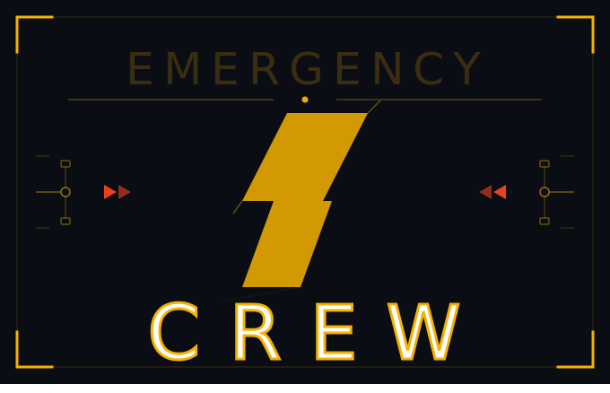

# 🚨 Emergency Crew

> *"Réparez la station. Sabotez vos collègues. Devenez l'Employé du Mois."*

---

## 🎮 Présentation

**Emergency Crew** est un jeu multijoueur de survie technique en **2D isométrique**, jouable de **3 à 6 joueurs**.

Une équipe de maintenance se retrouve coincée dans une station (spatiale, sous-marine ou souterraine) au bord de l'effondrement. Les pannes se multiplient, les systèmes lâchent un par un, et le temps presse. Tout le monde doit mettre la main à la pâte pour empêcher la station d'exploser — mais à la fin, **un seul joueur sera sacré Employé du Mois**.

C'est là que réside le cœur du jeu : la **coopération est obligatoire pour survivre**, mais la **compétition individuelle décide du vainqueur**. Trop de sabotage entre joueurs et la station explose — tout le monde perd. Pas assez d'agressivité et vous laissez la victoire à quelqu'un d'autre.

---

## ⚡ Les Piliers du Jeu

### Urgence constante
Chaque manche dure entre **7 et 8 minutes 30** selon le nombre de joueurs. Le chrono ne s'arrête jamais. Les pannes arrivent par vagues de plus en plus intenses, réparties en trois phases :
- **Phase 1 — Calme avant la tempête** : une seule panne à la fois, rythme lent. Les joueurs découvrent la map et commencent à accumuler des points.
- **Phase 2 — Ça chauffe** : deux pannes simultanées, les objets de réparation deviennent insuffisants, les conflits commencent.
- **Phase 3 — Alerte Rouge** : jusqu'à trois pannes en même temps, et la **Surchauffe** peut se déclencher — un compte à rebours de 30 secondes qui, s'il atteint zéro, détruit la station immédiatement.

### Combat non-létal
On ne tue personne dans Emergency Crew. Le combat sert uniquement à **interrompre et ralentir** les autres joueurs. Deux actions sont disponibles :
- La **Bousculade** : action rapide qui repousse un joueur et lui fait lâcher son objet. Elle ne peut pas interrompre une réparation en cours.
- Le **Coup Chargé** : action lourde qui nécessite une seconde d'immobilité pour charger. Si elle touche, la cible est étourdie pendant 2 secondes et lâche son objet. C'est la **seule action capable d'annuler une réparation en cours**, ce qui en fait l'outil de sabotage ultime — mais aussi le plus risqué, puisque le joueur est vulnérable pendant la charge.

### Inventaire minimal
Chaque joueur ne dispose que d'**un seul emplacement d'inventaire**. Il peut contenir un objet de réparation (Kit de Soudure, Fusible, Liquide de Refroidissement) ou un outil spécial rare (Clé Dorée, Bottes Magnétiques, Scanner). Jamais les deux en même temps. Ce slot unique transforme chaque ramassage en décision stratégique et chaque objet posé au sol en opportunité de vol.

---

## 🔧 Les Pannes

Les pannes apparaissent dans les **Salles Techniques** de la station. Chaque type de panne nécessite un objet spécifique pour être réparé, et produit un effet négatif tant qu'elle est active :

| Panne | Objet requis | Effet si non réparée | Temps de réparation |
| :--- | :--- | :--- | :---: |
| **Fuite de Gaz** | Kit de Soudure | Ralentit tous les joueurs dans la zone | 3s |
| **Court-Circuit** | Fusible | Brouillard de guerre (vision réduite) | 3s |
| **Surchauffe** | Liquide de Refroidissement | Compte à rebours de 30s → Game Over total | 4s |

Pour réparer, le joueur doit se placer devant le panneau de la panne avec le bon objet en main et maintenir l'interaction. Pendant ces secondes de réparation, il est **immobile et vulnérable** au Coup Chargé.

---

## 🏗️ La Station

Chaque map est conçue à la main et suit un template de **5 salles** :
- **1 Salle de Stockage centrale** : le point névralgique où apparaissent les objets de réparation et les outils spéciaux. Il n'y a jamais assez d'objets pour couvrir toutes les pannes actives — la pénurie est voulue.
- **4 Salles Techniques** : réparties autour du Stockage, c'est là que se déclenchent les pannes. Les couloirs qui les relient deviennent des zones d'embuscade naturelles.

---

## 📊 La Jauge de Stabilité

C'est la barre de vie de la station, visible en permanence en haut de l'écran. Elle démarre à **100 points** et descend tant que des pannes restent actives (de -2 à -5 pts/seconde selon le type). Chaque réparation réussie la fait remonter de 10 points. Si elle tombe à zéro, la station est détruite et **tout le monde perd**.

---

## 🏆 Score & Classement

Chaque action rapporte des **Crédits de Maintenance** :

| Action | Crédits |
| :--- | :---: |
| Réparation mineure (Gaz, Court-Circuit) | 20 pts |
| Réparation critique (Surchauffe) | 100 pts |
| Coup Chargé réussi | 5 pts |
| Aide coopérative (présence en salle pendant une réparation alliée) | 10 pts |

### Écran de fin — Victoire (station sauvée)
| Titre | Critère |
| :--- | :--- |
| 🏆 **Employé du Mois** | Le plus de Crédits de Maintenance |
| 🔧 **Héros Silencieux** | Le plus de réparations critiques |
| 👊 **Le Saboteur** | Le plus d'interruptions infligées |
| 📋 **Le Stagiaire** | Le moins de Crédits de Maintenance |

### Écran de fin — Défaite (station détruite)
Le temps de survie et les stats individuelles sont affichés. Titre collectif : **"Licenciés pour Faute Grave"**.

---

## 🛠️ Stack Technique

- **Rendu :** 2D Isométrique (tuiles 64×32)
- **Réseau :** Server-authoritative
- **Environnement :** WSL (Ubuntu)

---

## 🚧 Roadmap

### Phase 1 — Design
- [x] Rédaction du Game Design Document
- [ ] Level design de la première map

### Phase 2 — Prototype jouable
- [ ] Déplacement isométrique fluide
- [ ] Collision et bousculade entre joueurs
- [ ] Système de ramassage / dépose d'objet
- [ ] Coup Chargé et système de stun
- [ ] Première map jouable (5 salles)

### Phase 3 — Systèmes de jeu
- [ ] Système de pannes (spawn, escalade en 3 phases)
- [ ] Mécanique de réparation (barre de progression)
- [ ] Jauge de Stabilité
- [ ] Inventaire à 1 slot
- [ ] Spawn des objets en Salle de Stockage

### Phase 4 — Multijoueur & Score
- [ ] Architecture réseau (server-authoritative)
- [ ] Synchronisation des joueurs
- [ ] Système de score (Crédits de Maintenance)
- [ ] Écran de fin et classement

### Phase 5 — Contenu & Polish
- [ ] Maps supplémentaires
- [ ] Outils spéciaux (Clé Dorée, Bottes Magnétiques, Scanner)
- [ ] Contenu dynamique (portes, couloirs destructibles)
- [ ] UI, sons, effets visuels
- [ ] Playtest & équilibrage

---

## 🗂️ Documentation

| Document | Contenu |
| :--- | :--- |
| [`01_Vision_Globale.md`](01_Vision_Globale.md) | Concept, piliers du jeu, dilemme central |
| [`02_Regles_Et_Mecaniques.md`](02_Regles_Et_Mecaniques.md) | Règles complètes, combat, pannes, inventaire, scoring |
| [`03_Systemes_Et_Objets.md`](03_Systemes_Et_Objets.md) | Types de pannes, objets, jauge de stabilité |
| [`04_Score_Et_Progression.md`](04_Score_Et_Progression.md) | Barème des crédits, écran de fin, podium |
| [`05_Technical_Setup.md`](05_Technical_Setup.md) | Architecture technique, réseau, prochaines étapes |

---

## 👥 L'Équipe

- [@A-Jeaugey](https://github.com/A-Jeaugey)
- [@Ito-x](https://github.com/Ito-x)
- [@martin21dfx](https://github.com/martin21dfx)
- [@SynnIA](https://github.com/SynnIA)
- [@S-Mopty](https://github.com/S-Mopty)

---

*"La station ne va pas se réparer toute seule. Enfin si, mais pas assez vite."*
